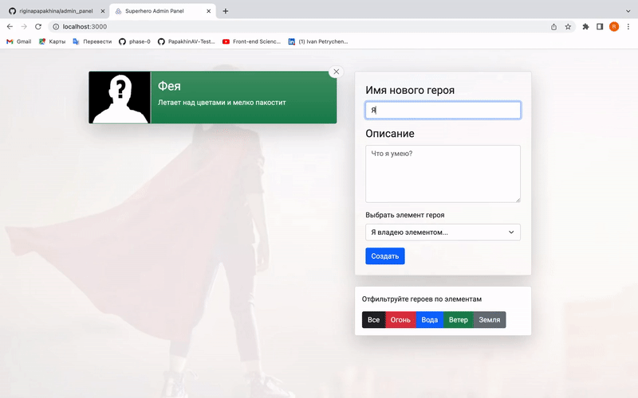
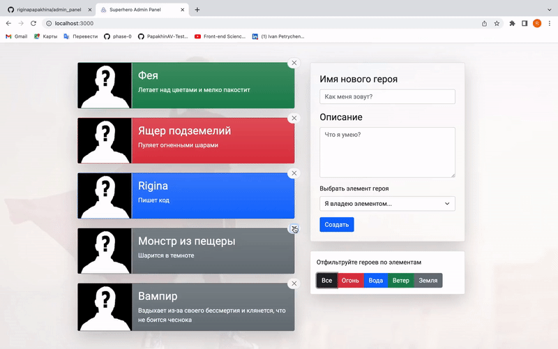

# React+Redux административная панель
## Стэк - React, Redux, JS, HTML, CSS
## Библиотеки: concurrently, uuid, classnames, react-transition-group, reselect, redux-thunk, redux toolkit
### Разработчик:
- [Ригина П.]

### Панель администратора позволяет:
- Добавлять и удалять персонажей
- Фильтровать персонажей по стихиям
#
### `Добавление персонажа`
Персонаж создается и попадает в общий state, через uiid ему генерируется уникальный id

#
### `Удаление персонажей`
 Функция onDelete в HeroesList.js берет id и по нему удаляет ненужного персонажа из store только если запрос на удаление прошел успешно

#
### `Фильтрация персонажей`
 Фильтр отображает только нужных героев при выборе. Активный фильтр имеет класс active

#
### Запросы на сервер:
- GET - загрузка героев
- POST - создание и отрпавка на сервер
- DELETE - удаление героев

### Выполненная работа:
- Написание компонента по созданию персонажа и присвоения ему уникального id
- Написание компонента для удаления персонажа из state при нажатии на "крестик". 
Функция onDelete в файле HeroesList.js берет id и по нему удаляет ненужного персонажа из store
- Внесение изменений в json файл для удобства написания компонента фильтрации персонажей
- Разделение reducers для дальнейшего удобства работы и применение CreateSelector() из reselect
- Улучшение store и добавление ему новых возможностей при помощи Store enhancers. В качестве практики создан собственный кастомный enhancer. Добавление applyMiddleWare()
- Подключение redux-thunk. Он используется для замедленного отображения блоков с персонажами. В файле actions.js функция activeFilterChanged получила setTimeout()
- Применение redux toolkit:
configureStore()
createSlice()
createAsyncThunk()
createEntityAdapter()

### Работа библиотек:
- concurrently - запускает 'react-scripts start' и 'npx json-server' на разных портах для избежания конфликта
- uuid генерирует уникальный id для персонажей при создании
- classnames - cоздает динамические классы. В проекте использовалась для подсветки кнопок фильтра
- react-transition-group создает подобие анимации при всплытии и исчезании блоков персонажей в панели
- reselect - мемоизирует функции селекторы 
- redux-thunk - в качестве действий позволяет отправлять не объекты, а функции, а когда диспэтчатся функции, внутри них это дает бОльшую свободу действий( в т.ч. и асинхронные операции)
- redux toolkit - делает использованную ранее библиотеку reselect бесполезной т.к. имеет сходный функционал + добавляет функционал redux-thunk

[Ригина П.]: https://github.com/riginapapakhina
